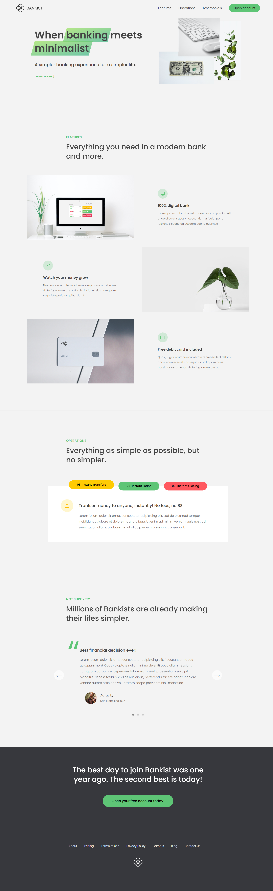

# Bankist Website

## Table of contents

- [Overview](#overview)
  - [Screenshot](#screenshot)
  - [Links](#links)
- [My process](#my-process)
  - [Built with](#built-with)
  - [What I learned](#what-i-learned)
  - [Continued development](#continued-development)
- [Author](#author)

## Overview

Bankist is the official website for a fictional bank that complements the other bankist website that was developed for users to complete transactions and use all kinds of different features.
this official site on the other hand, is a landing page for the bank itself, showcasing the features of the bank, complete with testimonials, forms for signing up, and a nice looking nav.

- Advanced DOM manipulation techniques like using event delegation which helped in styling the nav items to give it a more beautiful look when hovered, among many other uses for this powerful technique.

- Smooth scrolling for a better viewing experience.

- Good looking forms and modals.

- Lazy loading images.

- Carousel component for the testimonials.

This project is largely based on the "The Complete JavaScript Course 2023: From Zero to Expert!" by Jonas Schmedtmann on Udemy.

### Screenshot

### Links

- Live Site URL: (https://safensound95.github.io/bankist-website/)

## My process

### Built with

- HTML5
- CSS
- Flexbox
- CSS Grid

### What I learned

Where to start? this one had it all, from advanced dom manipulation, smooth scrolling, lazy loading images, to a working slider and carousel components, this is a truly beautiful landing page filled with the amazing features that the best websites have.
implementing all these features on my own sure took lots of practice and trial and error, and a lot of use of most of the tools in the language.

### Continued development

Again, where to start? haha, definitely returning to this one when I actually make the rest of the pages "About, Pricing,etc..." and turn it from a landing page to a fully fledged website filled with real content.
also when I get more comfortable with the backend I'll get back to it so I can get the sign in and forms working.

## Author

- Frontend Mentor - [@SafeNSound95](https://www.frontendmentor.io/profile/SafeNSound95)
- Codewars - [@SafeNSound95](https://www.codewars.com/users/SafeNSound95)
- Exercism - [@SafeNSound95](https://exercism.org/profiles/SafeNSound95)
